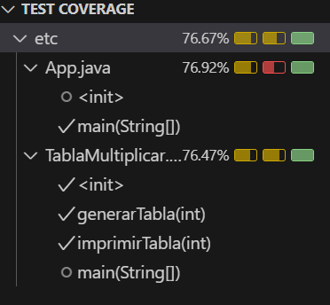

# Ejercicio: Tabla de Multiplicar

## Descripción
Crea una clase que tenga la responsabilidad de crear la tabla de multiplicar de un número. 

Dado un número entero `n`, devuelva su tabla de multiplicar (del 1 al 10). Cada múltiplo `n * i` (donde `1 <= i <= 10`) debe imprimirse en una nueva línea en la forma: `n x i = resultado`.

## Ejemplo
**Dado:** `n = 5`

**Output:**
```
5 x 1 = 5
5 x 2 = 10
5 x 3 = 15
5 x 4 = 20
5 x 5 = 25
5 x 6 = 30
5 x 7 = 35
5 x 8 = 40
5 x 9 = 45
5 x 10 = 50
```

## Requisitos
- La clase deberá ser testeada
- Mínimo 70% de coverage

## Entregables
- Repositorio de Github
- Captura de pantalla del coverage


## Test coverage
